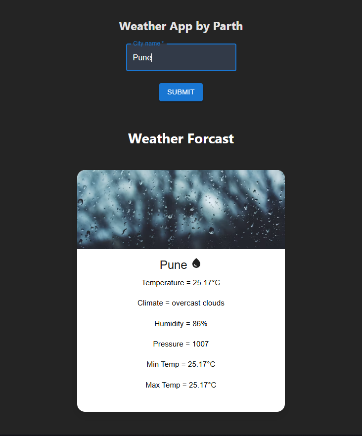

🌤️ Weather App — React & JavaScript Project

Features
🔎 City Search Functionality -
Users can input any city name to fetch and display current weather conditions.

📡 Real-Time Weather Data
1) Integrates with the OpenWeatherMap API to provide:

2) Temperature (in °C).

3) Maximum temperature.

4) Feels like temperature

5) Weather conditions (e.g., cloudy, sunny, rainy)

6) Humidity

⚛️ React Hooks (useState & useEffect)
Utilized for managing state and side effects such as fetching data when a new city is searched.

📱 Responsive Design
The layout adjusts smoothly across different screen sizes for both desktop and mobile users.

Link- comming soon..

- Author
  Parth Sakpal

